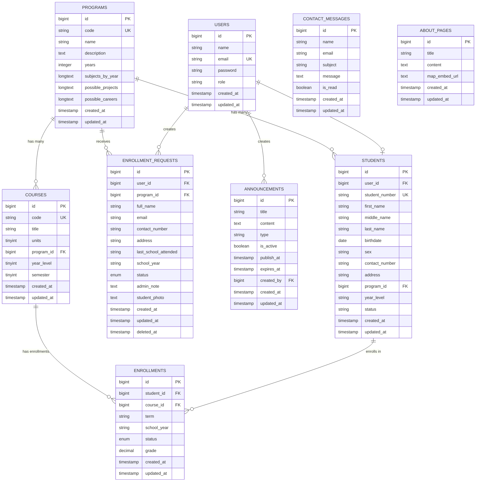

# Entity Relationship Diagram (ERD)
## EduPath Application Database Schema

## Entity Relationships

### Core Relationships

1. **Users → Students** (One-to-One)
   - A user can have one student profile
   - Foreign Key: `students.user_id` → `users.id`
   - Cascade on delete

2. **Users → Enrollment Requests** (One-to-Many, Optional)
   - A user can create multiple enrollment requests
   - Foreign Key: `enrollment_requests.user_id` → `users.id`
   - Nullable (requests can exist without user account)

3. **Users → Announcements** (One-to-Many)
   - A user can create multiple announcements
   - Foreign Key: `announcements.created_by` → `users.id`

4. **Programs → Students** (One-to-Many)
   - A program can have many students
   - Foreign Key: `students.program_id` → `programs.id`
   - Nullable (students can exist without program initially)

5. **Programs → Courses** (One-to-Many)
   - A program can have many courses
   - Foreign Key: `courses.program_id` → `programs.id`
   - Nullable

6. **Programs → Enrollment Requests** (One-to-Many)
   - A program can receive many enrollment requests
   - Foreign Key: `enrollment_requests.program_id` → `programs.id`
   - Cascade on delete

7. **Students → Enrollments** (One-to-Many)
   - A student can have many course enrollments
   - Foreign Key: `enrollments.student_id` → `students.id`
   - Cascade on delete

8. **Courses → Enrollments** (One-to-Many)
   - A course can have many student enrollments
   - Foreign Key: `enrollments.course_id` → `courses.id`
   - Cascade on delete

### Standalone Entities

- **Contact Messages**: No foreign key relationships
- **About Pages**: No foreign key relationships

## Key Constraints

### Unique Constraints
- `users.email` - Unique
- `students.student_number` - Unique
- `programs.code` - Unique
- `courses.code` - Unique
- `enrollments(student_id, course_id, term, school_year)` - Composite unique

### Foreign Key Constraints
- `students.user_id` → `users.id` (CASCADE DELETE)
- `students.program_id` → `programs.id` (NULL ON DELETE)
- `courses.program_id` → `programs.id` (NULL ON DELETE)
- `enrollments.student_id` → `students.id` (CASCADE DELETE)
- `enrollments.course_id` → `courses.id` (CASCADE DELETE)
- `enrollment_requests.user_id` → `users.id` (NULL ON DELETE)
- `enrollment_requests.program_id` → `programs.id` (CASCADE DELETE)
- `announcements.created_by` → `users.id` (CONSTRAINED)

### Soft Deletes
- `enrollment_requests` - Uses soft deletes (`deleted_at` column)

## Data Flow

### Enrollment Process Flow
1. User submits **Enrollment Request** → Links to **Program**
2. Admin approves request → Creates **User** account (if not exists)
3. Admin creates **Student** record → Links to **User** and **Program**
4. System auto-creates **Enrollments** → Links **Student** to **Courses** in program

### Academic Structure
- **Programs** contain multiple **Courses**
- **Students** belong to a **Program**
- **Students** enroll in **Courses** through **Enrollments**
- **Enrollments** track term, school year, status, and grades

